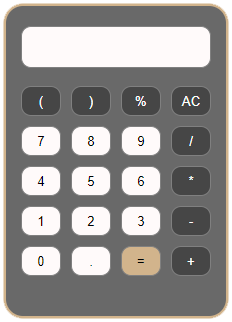

# Calculator
## Github page

[Calculator](https://gaudrey.github.io/calculator/)

## Project infos

* **Duration:** 2-3 days
* **Deadline:** 18 november 2020, 19:00
* **Team challenge:** solo

## Objectives

* Generate a calculator with JS
* Use JS to calculate basic operations

## What did I use?

* HTML
* CSS
* JavaScript

## How did I do it?

I tried to use the framework Bulma but I gave up that idea quickly. The responsive part was a greater inconvenience than help.

A grid in CSS was a better option, easier to generate in JS too.

## Generate the calculator

I started with the HTML to get an idea of my DOM. After that, I used the JS to build my calculator, defined my array and did a for loop to create my buttons.

For a better visibility, I opened a new JS file for operation only. Because we were said that the function `eval` is evil, we were given a function that I copy-paste. With a `querySelector`, I pined down what I needed to create a new for loop in which I started an event. After that, with the help of `if`, `else if` and `else`, I started to build my conditions.

## What can be improved?

Many things. We can enter several identicals signs, use the parentheses in any order and so on. I choosed to block the result when the user click on equal... not really a good solution and we can't use the last result to start a new operation.

## Conclusion

It was not easy and many times. I looked for complicated answers and I think it's not the cleanest solution from several angles. This project was a challenge but it proved to me that I was capable to do more than I thought.